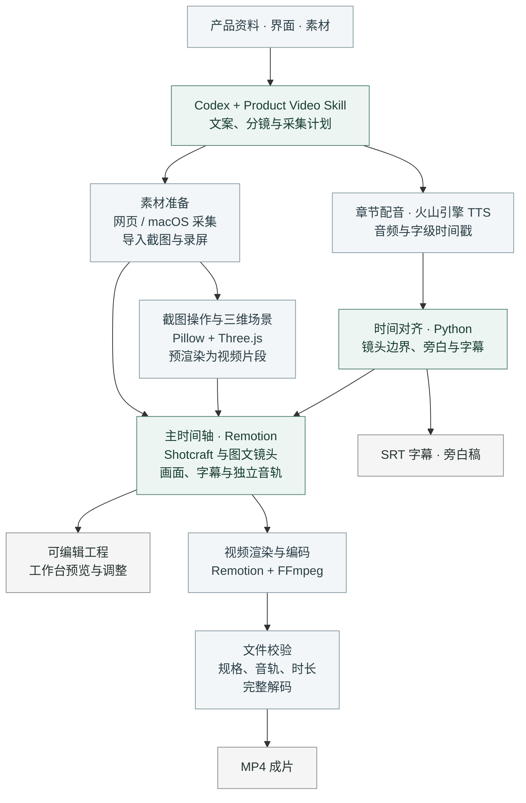

<div align="center">


# Product Video

[效果预览](#效果预览) · [安装](#安装) · [使用](#使用) · [工作原理](#工作原理) · [文档](#文档)

</div>

Product Video 是用于 Codex 的产品视频制作 Skill。它根据项目资料与实际界面组织介绍内容，完成素材采集、镜头编排、配音和字幕合成，输出 MP4 及可编辑工程。视频长度由需要说明的内容和功能流程决定，不把固定片长当作产品能力。

适用于软件产品介绍、功能演示、操作教程和版本发布视频。支持无配音纯字幕和按需配音，导入已有文稿、截图与录屏，也可从指定网页、Windows 目标窗口或 macOS 应用采集界面。Windows 窗口采集为只读截图；网页支持自动操作与录屏。

## 功能

图文布局包括功能总览、图文并排、卡片陈列和双图对照。镜头库集成 [video-shotcraft](https://github.com/Vincentwei1021/video-shotcraft)，覆盖界面入场、运镜、转场、文字动画和收尾。截图、二维真实录屏与文字可以在同一视频中混排；录屏步骤可在结果出现后用轮廓或聚光高亮标注目标区域。

三维场景提供手机、平板、笔记本和屏幕面板等模型，支持材质、灯光与镜头运动。设备屏幕可使用截图或录屏，场景可与二维画面衔接。

旁白按章节合成，字幕与镜头依据实际音频时间对齐。配音角色、语速、背景音乐和音效可以分别设置。修改画面时，文稿及音色参数相同的配音会复用已有缓存。

工作台提供画面预览、镜头排序、时长调整和音轨编辑。多图布局、聚焦时间等参数由 Skill 在项目配置中调整；生成后仍可继续修改文案和镜头。

## 效果预览

[](docs/assets/editorial-demo.mp4)

[图文排版与界面动效示例](docs/assets/editorial-demo.mp4)

[](docs/assets/studio-demo.mp4)

[三维设备与录屏示例](docs/assets/studio-demo.mp4)

两段样片均使用演示素材，无旁白。

### 视觉风格

| 经典 | 产品 | 宣传 | 教程 |
| --- | --- | --- | --- |
|  |  |  |  |
| 完整界面展示 | 侧栏图文 | 大标题与错位构图 | 步骤导览 |

| 影院 | 画廊 | 极简 |
| --- | --- | --- |
|  |  |  |
| 宽幅构图 | 装裱式陈列 | 平面网格 |

## 安装

运行环境需要 Python 3.11+、Node.js 22+、npm、FFmpeg（含 ffprobe）及中文字体。Windows 提供 PowerShell 安装/运行入口；具体支持范围、纯字幕配置及验收边界见 [Windows 说明](docs/windows.md)。Linux 尚未完成整体验证。

Windows 在完整仓库目录运行，参数指定本机已有运行库：

```powershell
./scripts/setup.ps1 -Python 'D:/runtimes/python/python.exe' -Node 'D:/runtimes/node/node.exe' -FfmpegDirectory 'D:/tools/ffmpeg/bin'
./scripts/run.ps1 render 'D:/视频项目/产品 demo/project.json'
```

macOS：

```sh
git clone https://github.com/Lincb522/product-video.git ~/.codex/skills/product-video
sh ~/.codex/skills/product-video/scripts/setup.sh
```

安装脚本配置 Python 依赖、镜头工作台及浏览器运行环境。也可下载 [完整安装包](https://github.com/Lincb522/product-video/releases)，将解压后的 `product-video` 目录放入 Codex 的 `skills` 目录，再运行 `scripts/setup.sh`。安装目录已存在时，应先保留其中的自定义修改。

纯字幕项目设置 `voice: {"mode":"none"}` 与每章 `duration`，不需要账号或密钥，沿用完整 Remotion 制作与工作台导出流程。需要配音时使用火山引擎 TTS，需要可用的账号与额度；首次生成配音会打开本机配置页。音色授权以账号实际开通情况为准。

## 使用

在 Codex 中指定 `$product-video`、介绍对象和制作要求：

```text
使用 $product-video，为当前项目制作一支中文介绍视频。
面向首次使用该产品的用户，介绍核心功能和一个完整操作流程；按功能数量和操作结果安排足够的内容与时长。
使用当前版本界面，采用产品风格，输出 1080p MP4 和字幕。
```

介绍对象可以是当前项目、产品网址或应用。目标观众、内容范围、时长约束、风格和配音角色均可指定；已有确认稿或素材时，提供对应文件即可。Skill 会先整理分镜与 Shotbook，再生成采集计划和视频配置。完整功能尽量按“入口或前状态 → 关键动作 → 可见结果 → 必要细节”展开；只有终态图时不会虚构成完整教程。

修改已有视频时，说明需要调整的段落和内容。例如：

```text
修改第二段的搜索演示，展示筛选条件和结果列表。
保留其他段落与配音，结果画面停留 3 秒。
```

网页采集可录制实际输入、点击和滚动。截图操作演示在操作前后画面之间添加指针移动和点击反馈；需要呈现连续的界面变化时，应使用录屏素材。

先做一段约 20–30 秒、覆盖主要视觉类型的有声或静音样板镜，再按后续内容扩展全片。样板用于检查字幕可读性、操作前后状态、结果驻留和动效用途，不是成片时长限制。修改反馈使用“时间或帧 + 对象 + 实际问题 + 期待变化”的格式；后半段出现新信息时重新安排画面，不机械复制样板动效。

## 输出

成片采用 H.264 / AAC 编码，封装为 MP4，并附字幕、旁白稿和可编辑工程。默认规格为 1920×1080、30 fps；当前支持 16:9 画幅和 24–60 fps。

配音项目的中文、英文字幕根据语音时间戳生成。纯字幕项目使用明确的章内字幕时间，或按文稿分配显示时间，不声称语音对齐。两种模式均提供 SRT 和可编辑字幕轨；无配音工程不生成分章旁白。

`check` / `build` 会附带 `pacing-review.json` 建议，提示字幕密度与留时、动作后的结果驻留、过长静止和缺少前后状态。报告只供调整参考，不自动改写用户明确的章节或步骤时长。最终仍需查看关键帧并播放 MP4，确认画面、时间线、字幕和真实操作结果。

## 工作原理

Codex 通过 Skill 整理产品资料、文案、分镜和采集计划。Python 引擎读取项目配置，处理素材与配音，并将镜头转换为可编辑的时间轴。



上图展示默认的 Remotion 合成流程。镜头时长取自实际配音，字幕根据字级时间戳对齐；旁白、音效和音乐分别上轨。Shotcraft 与图文镜头由 React / TypeScript 组件绘制，截图操作和三维场景先渲染为视频片段，再加入主时间轴。七种视觉风格也可通过 Python / Pillow 合成器直接输出视频。

工作台可保存和导出手动剪辑后的工程；命令行渲染则依据源项目配置重新编排。导出时通过 FFmpeg 完整解码，并校验规格、音轨和总时长。内容、操作过程及听感仍需播放复核。

## 文档

| 文档 | 内容 |
| --- | --- |
| [Windows 与纯字幕](docs/windows.md) | 安装、路径、无配音制作、只读窗口采集及边界 |
| [命令与配置](scripts/engine/README.md) | 项目参数、音色选择、字幕和导出 |
| [界面采集](references/capture.md) | 网页、Windows 目标窗口与 macOS 界面采集 |
| [图文排版](references/editorial.md) | 总览、卡片、并排与对照布局 |
| [镜头库与工作台](references/shotcraft.md) | 镜头选择、素材绑定与时间轴编辑 |
| [Shotbook 与内容时长](references/shotbook.md) | 内容量、功能闭环、样板镜和真实录屏结果高亮 |
| [三维场景](references/three-dimensional.md) | 设备模型、灯光、材质与录屏 |
| [文案与旁白](references/narration.md) | 介绍稿、画面文字与配音 |

## 许可

项目自有代码采用 [MIT 许可证](LICENSE)。第三方代码、依赖和音频素材遵守各自许可，来源与许可说明见 [NOTICE](NOTICE)。
